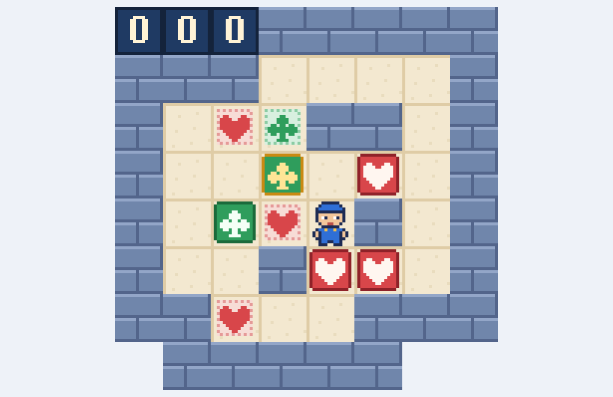

# Corazones y Tréboles

**Corazones y Tréboles** es la recreación fiel del puzzle **two color 17** de sokobanonline (comunidad, autor *HansZ*, 2016)
como juego web autónomo en **PuzzleScript Next**, con pixel-art 16-bit propio.

**▶ Jugar:** https://spyder-cripto.github.io/two-color-17/

## Controles
- **Flechas**: mover · **Z**: deshacer · **R**: reiniciar nivel · **X/Espacio**: empezar

## Mecánicas
Tablero de 8×8 con un solo mozo de almacén, **3 cajas de corazones** y **2 de tréboles**. Cada caja solo vale en una
diana de su mismo palo. Se empuja una caja cada vez, nunca dos seguidas y sin tirar. El contador cuenta un paso por
cada movimiento válido (andar o empujar); chocar no cuenta. Una caja de trébol empieza ya en su diana.

## Fidelidad
El port está verificado contra el motor real del juego original, ejecutado en local y sin red:
- 6 semillas × 250 movimientos al azar (1.506 estados, 45 empujes, 559 choques): mozo, cada caja con su palo y contador
  **idénticos en cada paso** en los dos motores.
- La solución óptima gana **en el paso 261, y no antes**, tanto en el motor real como en esta versión.

## Récord
El récord publicado del puzzle original es de **261 pasos** (kasarino). Una búsqueda exhaustiva en anchura de todo el
espacio de estados (6.178.599 estados alcanzables) demuestra que **261 es el óptimo: no existe solución más corta.**

## Créditos
- Puzzle original: **HansZ** (sokobanonline.com, 122447)
- Port, arte 16-bit y verificación: **Spider** (Fali + Claude), 2026
- Motor: [PuzzleScript Next](https://github.com/ClementSparrow/Pattern-Script) (derivado de PuzzleScript de increpare),
  incrustado en un único `index.html`
- Fuente del juego: [`juego.txt`](juego.txt)
